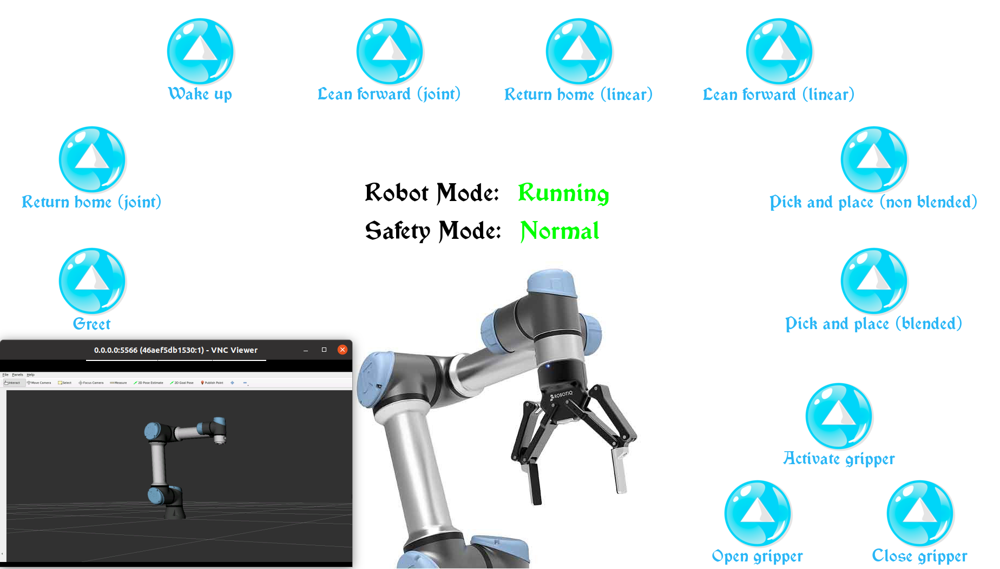
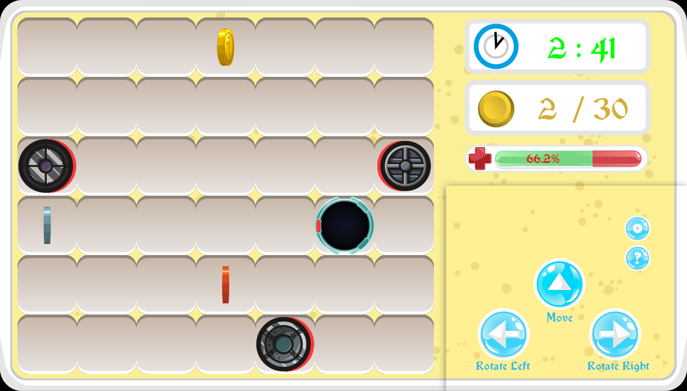
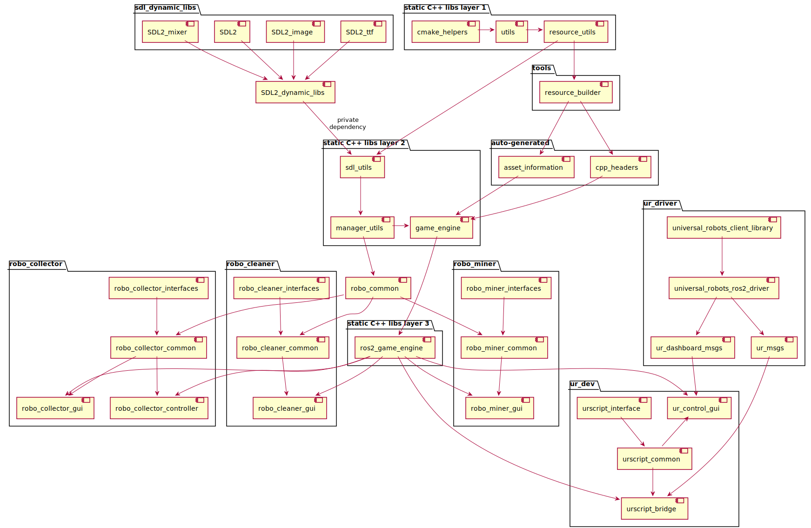

# robotics_v1

## A C++20 ROS2 Foxy Fitzroy workspace
This is the official repository for the Robotics Accelerator course, created by me and powered by Ocado Technology.
  - More on the training - refer to the [Robotics Accelerator page](https://pages.beamery.eu/ocadogroup/page/ot-sofia-roboticscourse2022)

The project utilizes a personal 2D game_engine set of libraries and highly configurable thread-per-component module  architecture.
  - More on the game_engine - refer to its [documentation](https://github.com/zhivkopetrov/game_engine)

The workspace contains several interesting, competitive, visual games with their respective ROS2 interfaces
- [Robo Collector](https://github.com/zhivkopetrov/robotics_v1/tree/master/src/robo_collector) - focused on learning ROS2 topics
- [Robo Miner](https://github.com/zhivkopetrov/robotics_v1/tree/master/src/robo_miner) - focused on learning ROS2 services
- [Robo Cleaner](https://github.com/zhivkopetrov/robotics_v1/tree/master/src/robo_cleaner) - focused on learning ROS2 actions
- [UR Dev](https://github.com/zhivkopetrov/robotics_v1/tree/master/src/ur_dev) - focused on learning UR robotics movements through URScripts
- [UR Driver](https://github.com/zhivkopetrov/robotics_v1/tree/master/src/ur_driver) - forked helper repositories for Universal Robots Client Library and Universal Robots ROS2 driver + description

## Previews
### ur_control_gui + Rviz2 + UR ros driver 2


### robo_collector_gui + robo_collector_controller


## ROS2 distribution
You're reading the documentation for an older, but still supported, version of ROS 2.  
For information on the latest version, please have at the 'master' branch.  

This repository operates under ROS2 Foxy Fitzroy distribution.
  - [ROS2 Foxy Fitzroy](https://docs.ros.org/en/foxy/index.html) is the official ROS2 distribution for Ubuntu 20.04 LTS
  
ROS2 Humble Hawksbill (newer) implementation is available under the 'master' branch
  - [ROS2 Humble Hawksbill](https://docs.ros.org/en/humble/index.html) is the oficial ROS2 distribution for Ubuntu 22.04 LTS

## Supported Platforms & Compilers
- Linux
  - g++ (>= 9.3)
    - Tested up to g++ 12
  - clang++ (>= 10)
    - Tested up to clang++ 14

- Windows
  - MSVC++ (>= 14.20) Visual Studio 2019
    - Tested up to 17.30 Visual Studio 2022
    - Note: enable Linux Bash Shell support under Windows to utilise the preset build scripts
    - Note2: although the game-engine is fully MSVC++ compatible, I haven't tested actual ROS2 functionalities on Windows

## Project automated installation 
All dependencies in the project could be conveniently installed via preset install scripts. 
For manual installation refer to 'Dependencies' and 'Third party libs' sections below.

Please note that ROS2 installation could be quite bulky.
For reference, a fresh Ubuntu 20.04 docker image with all compilers, tools, libs and ROS2 installed is close to 7GB.
That number could be reduced, but it's not a focus for this repository.
### Host usage
```
# Warning, the script will install dependencies directly on your host
sudo ./scripts/assisted_install/full_install_on_host.sh
```
Once the installation phase finishes, for convinience, you can add manual steps to your bashrc.
This way each time you open a NEW terminal session, they will be populated for you.
```
echo "export LANG=en_US.UTF-8" >> ~/.bashrc
echo "source /opt/ros/foxy/setup.bash" >> ~/.bashrc
echo "source /usr/share/colcon_argcomplete/hook/colcon-argcomplete.bash" >> ~/.bashrc
```
### Docker support
```
# All parameters are optional

# Clone dependencies on fresh Ubuntu 20.04 image, build and install artifacts
./scripts/assisted_install/full_install_in_docker.sh <ros2_distro> <enable_vnc_server> <enable_docker_in_docker>

# By default ros2_distro=foxy, enable_vnc_server=False, enable_docker_in_docker=False

# Start the image
./scripts/run/run_docker_file.sh <ros2_distro> <enable_privileged_mode>

# By default ros2_distro=foxy, enable_privileged_mode=False
# Privileged mode is required if you want to enable docker in docker support.
# For example starting the Universal Robots Simulator docker image inside robotics_v1 docker image (Docker in Docker)

# To access the VNC Server use a VNC Client of your choice
# For example VNC Viewer - https://www.realvnc.com/en/connect/download/viewer/

Access the VNC Server using local host and port 5920
Address: 127.0.0.1:5920
Password: robotics_v1

Doing so will lead you to Fluxbox.
Fluxbox is an extemely basic and lightweight stacking window manager for the X Window System.
All you need is probably a terminal session.
Right click -> Applications -> Shells -> Bash
```

## Colcon configuration. Building the project
Use plain Colcon commands to configure and build the project or use some of the existing preset build scripts.
### Basic usage
```
./scripts/assisted_build/full_build.sh
```
```
./scripts/assisted_build/partial_build.sh
```
### Advanced usage
```
# all parameters listed in the scripts are optional

# full build - automatic asset generation + build + install steps
# A full build is required only once in the beginning.
# For more information refer to the 'Automatic asset information generation' section
./scripts/assisted_build/full_build.sh <build_type> <verbose_build> <additional_colcon_options>

# partial build - build + install steps
# A partial build is the prefered, fast, with minimal compilation (build + install) procedure
./scripts/assisted_build/partial_build.sh <build_type> <verbose_build> <additional_colcon_options>

# <build_type> - Debug / Release / RelWithDebInfo / MinSizeRel
# Defaults to Debug
# This param is passed to CMAKE_BUILD_TYPE
# https://cmake.org/cmake/help/latest/variable/CMAKE_BUILD_TYPE.html

# <verbose_build> - True / False
# Defaults to False
# Verbose output for build and install steps

# <additional_colcon_options> - colcon specific parameters
# Defaults to none

# For plain colcon commands run 'colcon build --help'
# Or refer to the official colcon documentation:
# https://docs.ros.org/en/foxy/Tutorials/Beginner-Client-Libraries/Colcon-Tutorial.html
```

## Automatic asset information generation
The first time the project is manually build it will fail compilation.
The reason is because of missing auto-generated headers.
Those headers contain asset information such as image/sprite/text/sound texture data, asset locations, load policies, etc...
To auto-generate them use the following instructions:
```
# all parameters listed in the scripts are optional

./scripts/assisted_build/generate_asset_info.sh <build_type> <verbose_build> <additional_colcon_options>

# Note: the build preset script 'full_build.sh' already invoke 'generate_asset_info.sh' for you
```
Asset information generation should be executed only once in the beginning.
Or everytime you modify some of the assets or resource files (asset information descriptions)
  - More on resource files - check the [resource_builder tool documentation](https://github.com/zhivkopetrov/tools)

## Running the project
The project is composed of multiple ros2 packages, most of which contain a GUI.  
**Important:** as per colcon documentation - don't run ROS2 packages from the same terminal session used for building.
Instead run them from a separate terminal session.
```
# once the project is build - source its installed artifacts
source install/setup.bash

# run via normal colcon commands (ros2 run/launch)
# Note the 'ros2 launch' will load config files, while 'ros2 run' will use the default ones 
ros2 launch <node_name> launch.py

## Robo games
ros2 launch robo_collector_gui launch.py
ros2 launch robo_collector_controller launch.py
ros2 launch robo_miner_gui launch.py
ros2 launch robo_cleaner_gui launch.py

## Universal Robots Application suite setup
# If real hardware robot is used, the application suite will pick it up automatically.
# If instead a Universal Robots Simulator (URSim) is used, start it with:
./scripts/run/run_ursim_ur_driver_rviz.sh

# This will start a docker container which will contain:
# - Universal Robots ROS2 driver
# - Universal Robots Simulator (URSim) - utilising a ur5 robot
# - Rviz2

# Helper utility node, exposing beginner-friendly API from the robot
ros2 launch urscript_bridge launch.py

# Helper GUI node, which can control real hardware or a simulated robot
# The node is utilising the robot API exposed from the 'urscript_bridge' node
ros2 launch ur_control_gui launch.py
```

## Hardware requirements
This project utilizes hardware-accelerated graphics.
Any low-end GPU (integrated or dedicated) will be sufficient.
CPU usage is neglectable for the majority of projects and low-demanding for the Universal Robots Driver.

If however hardware-accelerated graphics could not be used - the GUI fallbacks to software rendering.
This could be the case if the project is ran inside a Virtual Machine with no hardware-acceleration.
Or if a cloud-hosted Virtual Machine is used. The majority of those lack hardware-acceleration support.
If Software rendering is used - the CPU usage will skyrocket.
By default the GUI is confgured to run at 60 FPS, which when using software rendering may hit the 100% CPU mark.

## Support for hardware-restrained (CPU cores and/or RAM) - a.k.a. toaster build
By default the colcon build system utilizes a parallel executor (simultaneous package build/install instructions).
If your package dependency graph allows it up-to <hardware_concurrency> CPU cores could be utilised.
```
# The simultaneous processed packages could be controlled with <additional_colcon_options>
--parallel-workers NUMBER (defaults to <hardware_concurrency>)
```

Additionally, the generation of ROS2 interfaces is an especially RAM intensive operation.
- Reference stats for a clean project build on 8 parallel CPU cores:
  - Using clang++ yields a peak of 800% CPU usage and 5 GB of RAM usage
  - Using g++ yields a peak of 800% CPU usage and 9 GB of RAM usage
    - Any subsequent builds then utilize only a small portion of the hardware resources 

To relief the hardware usage spike for initial builds:
```
# Pass a ' --parallel-workers 1' as <additional_colcon_options>

# Or completely change the executor type to 'sequential'
# Pass a ' --executor sequential' as <additional_colcon_options>
# You can achieve this step conveniently by invoking the following preset build script:
./scripts/assisted_build/toaster_build.sh <build_type> <verbose_build> <additional_colcon_options>

# any parameters passed to <additional_colcon_options> will be appended to the ' --executor sequential' option
```

## Dependencies (personal open-source libraries and tools)
This step decribes the manual installation of dependencies. For automated/assisted install refer to the 'Project automated installation' section.
Dependencies are integrated as git submodules. 
- To clone them, step inside the repository and run the following instructions
```
git submodule init
git submodule update
```
Those commands will clone the following repositories:
- [cmake_helpers](https://github.com/zhivkopetrov/cmake_helpers.git)
- [utils](https://github.com/zhivkopetrov/utils)
- [resource_utils](https://github.com/zhivkopetrov/resource_utils)
- [sdl_utils](https://github.com/zhivkopetrov/sdl_utils)
- [manager_utils](https://github.com/zhivkopetrov/manager_utils)
- [game_engine](https://github.com/zhivkopetrov/game_engine)
- [ros2_game_engine](https://github.com/zhivkopetrov/ros2_game_engine)
- [tools](https://github.com/zhivkopetrov/tools)

## Third party libs, which are not shipped with this repository
This step decribes the manual installation of third party libs. For automated/assisted install refer to the 'Project automated installation' section.
- ROS2 Foxy Fitzroy
  - For installation, please refer to the official [ROS2 Foxy Fitzroy installation documentation](https://docs.ros.org/en/foxy/Installation.html)

- Boost
  - Linux
    - Install through apt is sufficient
      ```
      sudo apt install libboost-dev
      ```
  - Windows
    - Refer to the official [boost installation documentation](https://www.boost.org/doc/libs/1_60_0/more/getting_started/windows.html#install-boost-build)

- SDL2 family libraries - SDL2, SDL2-image, SDL2-ttf, SDL2-mixer
  - Linux
    - Install through apt is sufficient
      ```
      sudo apt install libsdl2-dev libsdl2-ttf-dev libsdl2-image-dev libsdl2-mixer-dev
      ```
  - Windows
    - Download SDL2 packages from the official [SDL2 repository](https://github.com/libsdl-org/SDL/releases/latest)
    - Extract under "C:/SDL2" or alongside the project binary 

## Dependency hierarchy diagram

