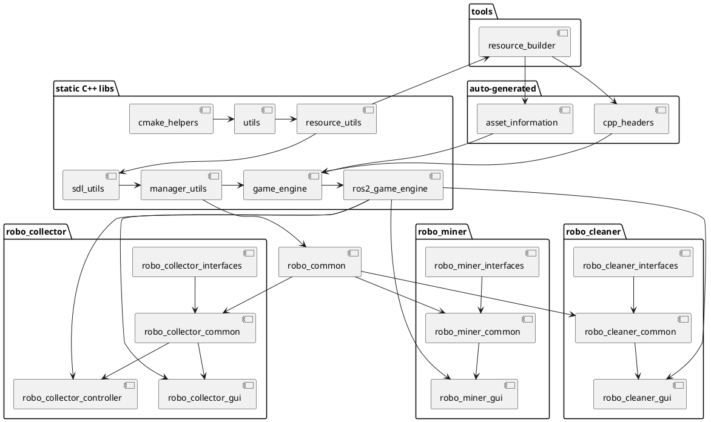

# robotics_v1

**A mostly C++ ROS2 workspace**

The workspace contains several intetesting visual mini-games and their respective ROS2 interfaces
- Robo Collector - focused on learning ROS2 topics
- Robo Miner - focused on learning ROS2 services
- Robo Cleaner - focused on learning ROS2 actions

